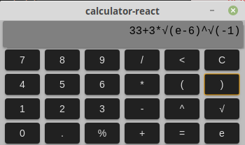

# React Calculator

React Calculator is a electron app built using [electron forge](https://github.com/electron-userland/electron-forge). 
The calculator supports most basic opperations including complex results. Currently the only way to use complex values is to write them in their exponential form.

## Usage 
To download the source code either download the repository zip file, or run
```sh
git clone https://github.com/LudoDe/reactCalculator.git
```
And then move to the repository directory and download all the dependencies
```sh
cd ./reactCalculator && npm install
```
To use the calculator execute
```sh
npm start
```

## Example


## License
[MIT](https://choosealicense.com/licenses/mit/)
